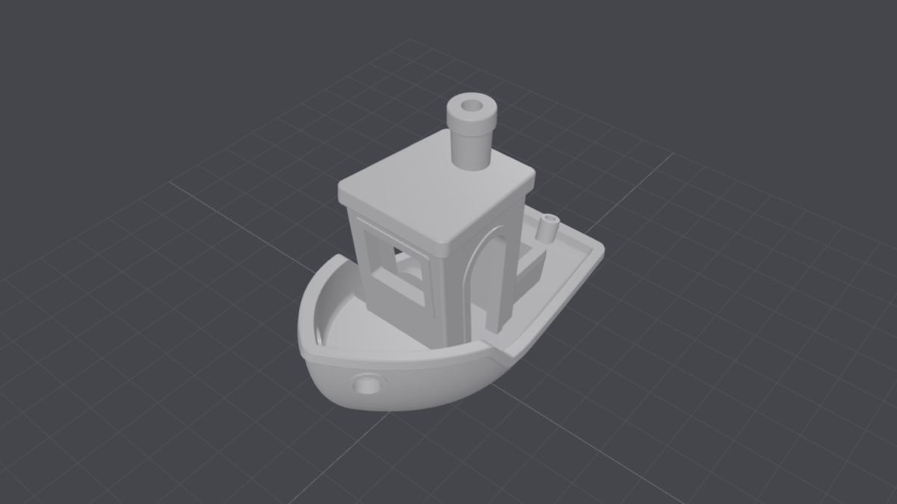

# Mesh Peek

Keyboard-first STL / 3MF glance for [Omarchy](https://omarchy.org/) Quattro.

One shortcut opens a clay-shaded Three.js viewer in Chromium. Not a slicer, not a CAD suite. Just a quick look at the mesh. STL, 3MF, OBJ, glTF, and glb are supported. Print/CAD files are Z-up by default.



## Install

```sh
omarchy plugin add https://github.com/monomyth/omarchy-meshpeek.git --enable
```

Then add the Super+Shift+Ctrl+V keybind — either:

```sh
bash ~/.config/omarchy/plugins/io.github.monomyth.meshpeek/scripts/install-bind.sh
```

…or paste `bindings.hypr.lua.example` into `~/.config/hypr/bindings.lua` yourself.

The install script only adds the bind if that chord is free; if something else owns it, it prints the conflict and exits.

Needs Chromium (or Chrome), plus `wl-paste`, `jq`, and `hyprctl`. First open caches Three.js under `~/.cache/omarchy/meshpeek/` (once; refreshes about weekly).

## Shortcut

**Super+Shift+Ctrl+V**

| Situation | What happens |
| --- | --- |
| Files focused, model selected | Opens that model |
| Files focused, nothing selected | Picker (won't reopen a stale clipboard file) |
| Any other app | Picker near newest model under Downloads / Prints |

## In the viewer

| Input | Action |
| --- | --- |
| Drag | Orbit |
| Scroll | Zoom |
| Right-drag | Pan |

Close the Chromium window when you're done. An optional bar icon exists; the keybind is the intended UI.

## Remove

```sh
omarchy plugin remove io.github.monomyth.meshpeek
```

## Optional

Default backend: **f3d if installed, otherwise Three.js**.

```bash
export MODELVIEW_UP=+Z            # or +Y / -Z / -Y
export MODELVIEW_BACKEND=threejs  # or f3d (must be installed)
```

## License

MIT
